# Voyage en famille — Andalousie — 26-29 avril 2026

5 adultes + 1 enfant en bas age (2 ans)

---

## MARBELLA / COSTA DEL SOL

### 10. Appartement New Golden Mile — ~500-600 EUR / 3 nuits

https://www.airbnb.com/rooms/51708496?check_in=2026-04-26&check_out=2026-04-29&adults=5&infants=1

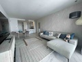 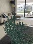 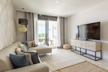 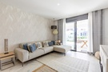 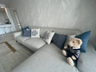 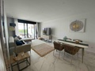 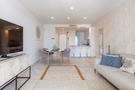 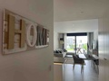 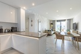 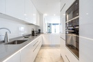 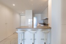 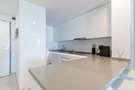 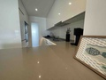 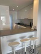 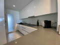 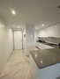 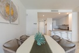 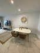 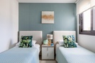 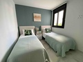 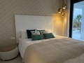 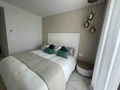 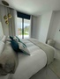 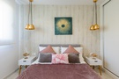 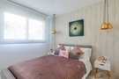 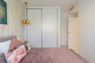 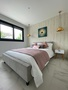 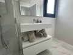 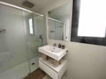 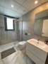 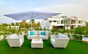 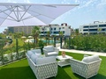 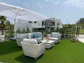 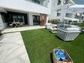 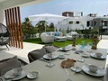 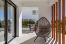 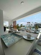 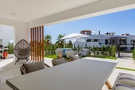 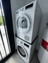 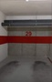 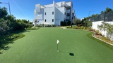 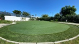 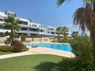 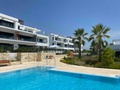 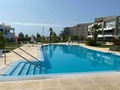 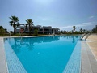 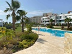 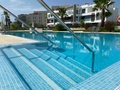 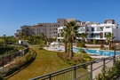 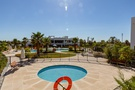  

- 3 chambres, 2 SDB | 4.92 (71 avis) | Hote : Ivan
- Entre Puerto Banus et Estepona, "New Golden Mile"
- ~40 min de l'aeroport de Malaga (AGP)
- Piscine partagee ouverte toute l'annee (9h-20h), vue jardin et piscine
- Lit bebe, lit parapluie (sur demande), chaise haute (sur demande)
- Barbecue + ustensiles, jardin prive cloture avec portillon verrouillable
- Terrasse/jardin prive donnant sur la piscine — rez-de-chaussee
- Parking gratuit dans la rue, supermarche a pied
- Exposition sud, moderne, climatisation
- Residence securisee avec jardins entretenus

Ce que disent les voyageurs : "Deux couples, deux bambins tres actifs et un bebe de 4 mois — on s'est sentis a l'aise des l'arrivee" — "Ivan a fourni un lit parapluie, une chaise haute et un kit de bienvenue avec du vin" — "Espace exterieur avec portillon verrouillable, parfait pour les enfants" — "On a fait un barbecue en famille, on se sentait chez nous" — "Sur et equipe pour bebes et tout-petits, lits tres confortables" — "Piscine immense, plusieurs bassins, tres calme meme en ete." 66 cinq-etoiles, 4 quatre-etoiles, 1 trois-etoiles. Un avis recent (mars 2026) mentionne des fourmis. Ivan est tres reactif.

---

### 1. Appartement familial de luxe, Benahavís — 630 EUR / 3 nuits

https://www.airbnb.com/rooms/1334977026129344249?check_in=2026-04-26&check_out=2026-04-29&adults=5&infants=1

                                      

- 3 chambres, 2 SDB | 5.0 (9 avis) | Hote : Bianca et Antonio
- ~50 min de l'aeroport de Malaga (AGP)
- Village de Benahavís dans les collines, a 10 min de Puerto Banus
- Barbecue + ustensiles, chaise haute, aire de jeux dans la residence
- Piscine a proximite (partagee), parking prive en garage, sauna + salle de sport
- Vue sur le coucher de soleil, terrasse privee, coin repas exterieur, transats
- Climatisation + chauffage central
- Pas de lit bebe repertorie — demander a Bianca (probable vu la chaise haute)

Ce que disent les voyageurs : "Tres spacieux et propre, la piscine est a 2 secondes a pied" — "Les enfants ont adore l'aire de jeux et le chiringuito" — "Exactement ce qu'il nous fallait avec deux enfants et deux grands-parents, largement assez d'espace pour six" — "Bianca propose des services supplementaires comme les transferts aeroport." 9 avis, tous 5 etoiles.

---

### 2. Maison de plage, Estepona — 763 EUR / 3 nuits

https://www.airbnb.com/rooms/1121709879195362073?check_in=2026-04-26&check_out=2026-04-29&adults=5&infants=1

                                       

- 3 chambres, 4 SDB | 4.86 (22 avis) | Hote : Manuel
- ~45 min de l'aeroport de Malaga (AGP)
- Front de mer sur la plage El Saladillo, Estepona. Acces direct plage + promenade
- Barbecue + ustensiles, lit bebe (sur demande), chaise haute (sur demande)
- Jardin prive entierement cloture, 2 places de parking en garage prive
- Douche exterieure, coin repas exterieur, mobilier de jardin

Ce que disent les voyageurs : "En bord de mer, sur la promenade parfaite pour les balades" — "Parfait pour des vacances en famille, face a la mer avec acces direct a la plage" — "Tres paisible, on avait tout ce qu'il fallait pour une famille de 6." Un avis allemand a signale une salle de bain malodorante et un cafard — sinon tout positif. 20 cinq-etoiles, 1 quatre-etoiles, 1 trois-etoiles.

---

## GRENADE

### 3. Maison troglodyte, Cenes de la Vega — 473 EUR / 3 nuits

https://www.airbnb.com/rooms/9329970?check_in=2026-04-26&check_out=2026-04-29&adults=5&infants=1

                                                   

- 5 chambres, 2 SDB | 4.88 (106 avis) | Hote : Encarni
- ~25 min de l'aeroport de Grenade (GRX)
- Moitie grotte / moitie maison moderne — experience andalouse unique
- Lit bebe, lit parapluie (toujours sur place), chaise haute, baignoire bebe, livres + jouets pour enfants, vaisselle enfant
- Jardin prive entierement cloture, barbecue, coin repas exterieur, douche exterieure
- Petite piscine dans cour muraille (fermee en avril — demander a Encarni de la couvrir)
- Bus n33 a proximite — 20 min du centre de Grenade pour 1,40 EUR
- Epicerie a 2 min a pied, restaurants a proximite
- Chambres troglodytes : naturellement fraiches, insonorisees, les enfants adorent

Ce que disent les voyageurs : "7 adultes et un bebe, spacieux pour tout le monde" — "Deux familles avec trois enfants et une grand-mere, les enfants ont adore les chambres troglodytes" — "Encarni nous a donne plein de recommandations, elle nous a meme conduits chez le mecanicien" — "Le chorizo du boucher du quartier est a essayer au barbecue." Parking dans la rue en contrebas avec 2 min de montee a pied (raide). Un avis signale les chats de la voisine et une odeur d'egout occasionnelle. Encarni a ouvert la piscine pour des voyageurs en avril alors que c'etait hors saison — elle est arrangeante.

---

### 4. Chalet Alhendin — 693 EUR / 3 nuits

https://www.airbnb.com/rooms/1455302797666187619?check_in=2026-04-26&check_out=2026-04-29&adults=5&infants=1

                                  

- 5 chambres, 3,5 SDB | 5.0 (31 avis) | Hote : Manuel et Ana Maria
- ~25 min de l'aeroport de Grenade (GRX)
- Alhendin, plaine de la Vega, 15 min du centre de Grenade en voiture
- Piscine avec cloture en bois, trampoline, table de ping-pong
- Barbecue / four a pizza (en pierre), cuisine jouet pour tout-petits, chaise haute
- Deux salons (un avec poele a pellets, un lumineux avec grandes baies vitrees)
- Garage prive avec borne Tesla, buanderie
- Climatisation + chauffage central, matelas confortables
- Kit de bienvenue a l'arrivee, suite avec jacuzzi

Ce que disent les voyageurs : "8 adultes et 4 enfants, tres confortable" (fev. 2026) — "Ils avaient un lit bebe, une chaise haute et des jouets, ideal pour les familles avec un bebe" — "Piscine et espace exterieur parfaitement entretenus" — "Encore mieux qu'en photos" — "Le meilleur c'est le nombre de salles de bain, il y en a meme une supplementaire dans le jardin." 31 avis, tous 5 etoiles. Seul bemol : voiture necessaire pour les courses (lotissement residentiel calme).

---

## ALMERIA (Cabo de Gata)

### 5. Casa Calilla, San Jose — ~300-400 EUR / 3 nuits

https://www.airbnb.com/rooms/24558411?check_in=2026-04-26&check_out=2026-04-29&adults=5&infants=1

                             

- 3 chambres, 3 SDB (une par etage) | 4.84 (129 avis) | Hote : Domingo
- ~35 min de l'aeroport d'Almeria (LEI)
- A 5 metres de la plage a San Jose, Parc Naturel du Cabo de Gata
- Lit bebe, lit parapluie, chaise haute
- Toit-terrasse avec vue panoramique sur la mer + monte-charge depuis la cuisine
- Jardin prive cloture, hamac, transats, coin repas exterieur
- 3 etages : salon + cuisine (RDC), 2 chambres (sous-sol), 1 chambre (etage)
- Pas de barbecue, pas de piscine, pas de clim (ventilateurs — ok en avril)

Ce que disent les voyageurs : "On entend les vagues depuis le lit" — "Le petit-dejeuner sur la terrasse en regardant le lever du soleil, c'etait merveilleux" — "Famille de 4, parfait pour decouvrir le Cabo de Gata fin avril" — "Restaurants et commerces accessibles a pied" — "Encore mieux qu'en photos." Les 2 chambres du sous-sol ont peu ou pas de lumiere naturelle (une n'a pas de fenetre). Escaliers raides sans barriere de securite vers le sous-sol — a surveiller avec un tout-petit. Mercadona a 30 min en voiture (Almeria), mais le village a des commerces de proximite. Plages de Genoveses, Monsul a 15-20 min en voiture. Fin avril : calme et paisible.

---

### 6. Maison avec piscine, Cabo de Gata — 1085 EUR / 3 nuits

https://www.airbnb.com/rooms/42798833?check_in=2026-04-26&check_out=2026-04-29&adults=5&infants=1

                                                                                          

- 3 chambres, 2 SDB | 5.0 (83 avis) | Hote : Federico
- ~30 min de l'aeroport d'Almeria (LEI)
- Maison de 160m2 a El Pozo de los Frailes, coeur du Parc Naturel du Cabo de Gata
- Piscine privee ouverte toute l'annee, jardin entierement cloture
- Chaise haute, jardin, terrasses, porche, douche exterieure
- Parking gratuit sur place
- Proche des plages de Genoveses, Monsul, Barronal

Ce que disent les voyageurs : Les 83 avis sont tous 5 etoiles. "Maison magnifique dans un cadre magnifique, le jardin et la piscine sont isoles et extremement reposants" — "Famille de 4, semaine fantastique, cuisine tres bien equipee" — "Sejour merveilleux avec notre bebe de 10 mois, la villa etait superbe" — "Un bijou d'architecture decore avec beaucoup de gout." Plusieurs familles avec bebes ont sejourne ici. Federico est tres reactif et donne d'excellentes recommandations de restaurants.

---

### 7. Villa El Paraiso, Retamar — 309 EUR / 3 nuits

https://www.airbnb.com/rooms/902814570281239719?check_in=2026-04-26&check_out=2026-04-29&adults=5&infants=1

                           

- 4 chambres, 2 SDB | 4.98 (41 avis) | Hote : Javier
- ~15 min de l'aeroport d'Almeria (LEI)
- Retamar, pres du Cabo de Gata, a 12 min d'Almeria
- Piscine partagee (saisonniere), jardin prive cloture, barbecue, garage
- Vaisselle enfant, deux terrasses, grands espaces verts
- Parking gratuit sur place

Ce que disent les voyageurs : "Deux familles avec enfants, tout a des distances raisonnables" — "Paisible, lumineux, beaucoup de lumiere" — "La piscine est commune mais on etait seuls a l'utiliser" — "Tres proche de la plage et du Cabo de Gata." 40 cinq-etoiles, 1 quatre-etoiles. Un avis a mentionne un probleme de cafards mais l'hote a reagi rapidement. Option economique a 309 EUR pour 3 nuits.

---

## SEVILLE

### 8. Casa Fertonia, Fuentes de Andalucia — 1028 EUR / 3 nuits

https://www.airbnb.com/rooms/865731588408229565?check_in=2026-04-26&check_out=2026-04-29&adults=5&infants=1

                            

- 5 chambres, 4,5 SDB | 5.0 (26 avis) | Hotes : Antonia et Fernando
- ~45 min de l'aeroport de Seville (SVQ), ~50 min de Cordoue
- Fuentes de Andalucia — maison de campagne andalouse, loin du chaos de la Feria
- Piscine privee avec bar et jacuzzi, barbecue
- Lit parapluie, climatisation dans toutes les chambres
- Douche exterieure, patio, coin repas exterieur
- Parking gratuit sur place

Ce que disent les voyageurs : Les 26 avis sont tous 5 etoiles. "La piscine est incroyable, avec un bar et plein de frigos pour garder les boissons au frais" — "Parfait pour les familles avec enfants, tres paisible" — "Excellent point de depart pour des excursions a Cordoue, Seville, Ronda, Carmona" — "Tout est neuf et tres propre." Antonia et Fernando sont loues pour leur gentillesse et leur attention.

---
